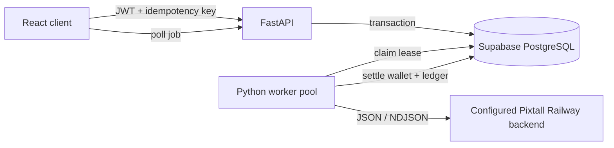
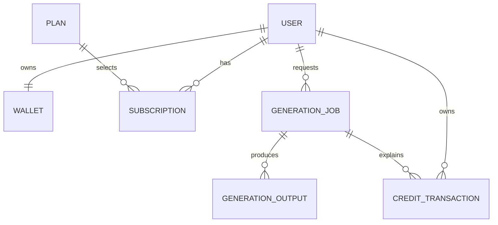
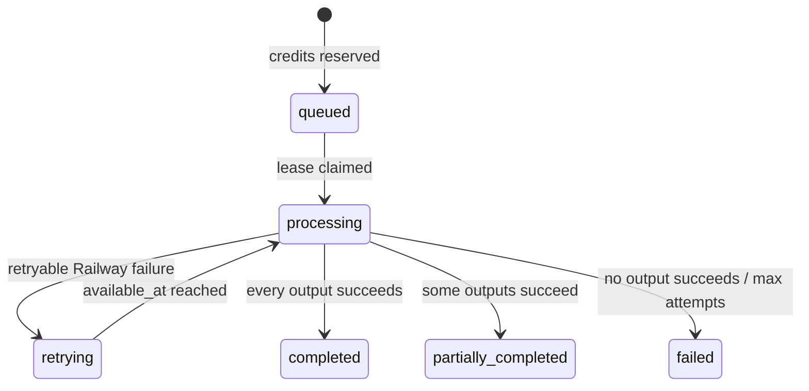

# Architecture

## Components

FastAPI owns validation and the authenticated HTTP boundary. PostgreSQL is both the system of record and durable queue. Worker threads provide bounded concurrency; multiple worker processes may run because row locking prevents duplicate claims. The configured Railway backend is the only generation integration. Its own image provider remains outside this service's scope.

## Data relationships

`wallets` is the current balance. `credit_transactions` is the immutable explanation of balance changes. The job links reservation, use, and release entries so every charged credit is traceable.

## State machine

All terminal states settle the entire reservation: `consumed + released = reserved`. A terminal job cannot transition again.

## Correctness boundaries

- Reservation locks one wallet row and updates wallet, job, and ledger before a single commit.
- `(user_id, idempotency_key)` is unique. The database, not an in-memory check, resolves races.
- Claiming selects one eligible job using `FOR UPDATE SKIP LOCKED`, assigns a lease, and commits before the Railway backend call.
- Expired processing leases become claimable after a worker crash.
- Settlement locks the job first and returns immediately for terminal jobs. It then locks the wallet and writes outputs, balances, and ledger entries in one commit.
- Database constraints prevent negative wallet balances and invalid image counts.

## Failure behavior

- HTTP `429`, Railway `5xx`, timeouts, and network failures are retried with exponential backoff and jitter.
- Railway `4xx` responses other than `429` are terminal because retrying the same invalid request cannot help.
- Malformed or missing NDJSON output fails only the affected output; successful outputs are still charged.
- Closing the browser has no effect after the reservation transaction commits.
- A crash before Railway completes lets the lease expire. The current backend contract has no client idempotency key, so a retry may repeat generation; wallet settlement nevertheless remains exactly once. Railway accepting the job ID as an idempotency key is the required future improvement for exactly-once generation.

## Architectural decisions

### FastAPI and typed Python

FastAPI matches the Python requirement, generates OpenAPI without a separate specification, and uses Pydantic at the trust boundary. Domain/database operations remain ordinary functions so framework code does not contain business rules.

### PostgreSQL as queue

The expected load does not justify Redis yet. PostgreSQL already provides durability, locking, ordering, and recovery. `SKIP LOCKED` allows horizontal workers without a coordinator. Move to a dedicated broker only when measured queue volume or scheduling requirements exceed the database approach.

### Explicit credit ledger

Balances alone cannot explain customer disputes. Each reservation, use, and release records both the delta and post-transaction available/reserved balances. Unique job/type entries make settlement operations idempotent.

### Authentication boundary

Development identity is convenient but unsafe. Production must validate a Supabase-signed JWT and derive the user from `sub`; request emails never establish ownership.

### Idempotency

Network clients retry. A caller-supplied key scoped to the authenticated user makes job submission safe. The same key returns the existing job rather than charging again.
